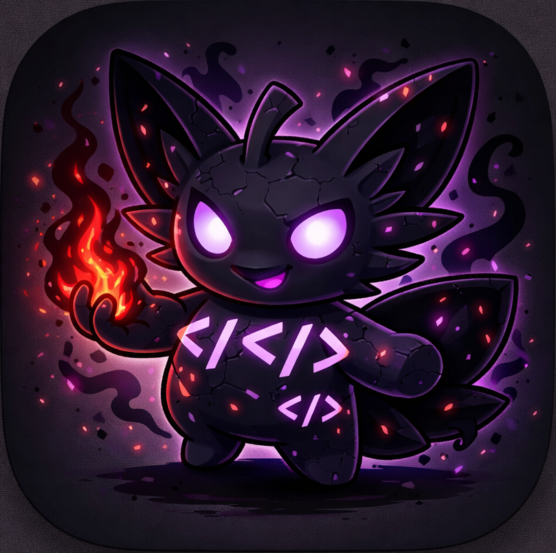
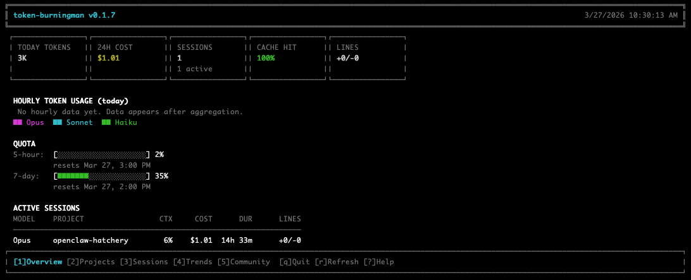
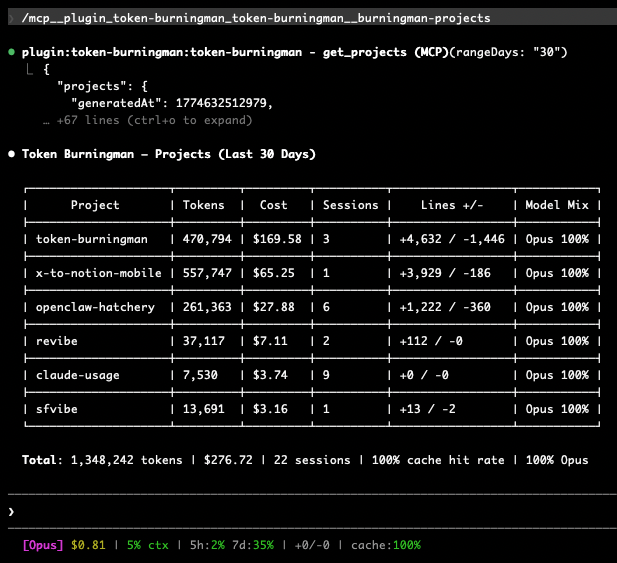
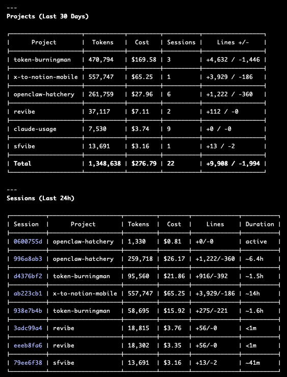
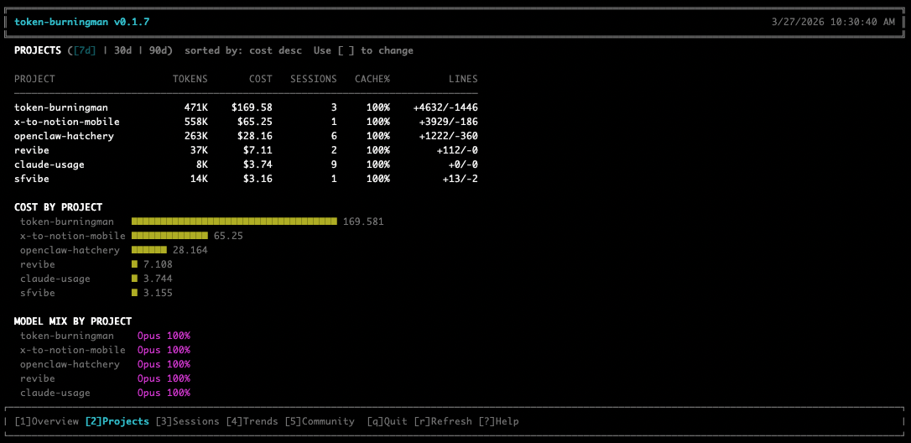
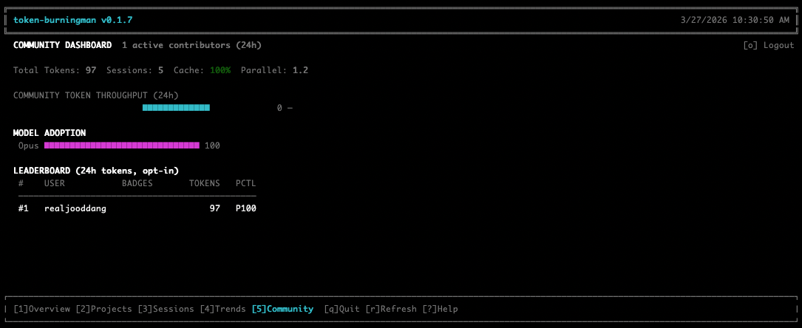

<p align="center">
  
</p>

<h1 align="center">token-burningman</h1>

<p align="center">
  <a href="LICENSE"></a>
  <a href="https://nodejs.org"></a>
</p>

<p align="center">Token usage analytics for <a href="https://claude.ai/claude-code">Claude Code</a> and Codex. Local-first. Privacy-safe.</p>

<p align="center">
  
</p>

## Features

- **Local analytics** — Per-session, per-project, per-model token counts, costs, and trends. Zero network dependency.
- **TUI dashboard** — 5 interactive views: Overview, Projects, Sessions, Trends, Community.
- **Statusline integration** — Real-time token/cost display in your Claude Code status bar (`full`, `compact`, `minimal`, or `off`).
- **Codex import** — Import local Codex token-count events into the same analytics and reporting pipeline.
- **MCP server** — Query usage data programmatically from Claude Code or Codex with tools, resources, and prompts.
- **Data export** — Export session or hourly data as JSON or CSV.
- **Community reporting** (opt-in) — Share anonymized hourly aggregates to a public dashboard at [sfvibe.fun](https://sfvibe.fun). Only hourly bucketed totals are shared — no project names, file contents, or session IDs.

## Prerequisites

- **Node.js 20+**
- **Claude Code** (for Claude plugin/statusline features; the TUI works standalone)
- **Codex CLI/App** (for Codex plugin/MCP features)

## Installation

### Claude Code plugin

```bash
# Add the marketplace
claude plugin marketplace add jooddang/token-burningman

# Install the plugin
claude plugin install token-burningman@jooddang
```

You can run the same commands inside Claude Code as slash commands:

```text
/plugin marketplace add jooddang/token-burningman
/plugin install token-burningman@jooddang
```

This registers the MCP server, session hooks, slash commands, and skills automatically. During setup, token-burningman installs a stable HUD wrapper at `~/.token-burningman/bin/statusline.mjs` and points Claude Code's `statusLine` command at that wrapper when no different statusline command is already present.

#### Claude Code updates

```bash
# Refresh marketplace metadata
claude plugin marketplace update jooddang

# Update the installed plugin
claude plugin update token-burningman@jooddang
```

Restart Claude Code after an update, or run `/reload-plugins` if Claude Code prompts you to reload. The HUD wrapper is intentionally stable across plugin versions: updates only rewrite `~/.token-burningman/.plugin-root` so the wrapper launches the newest installed `bin/collector.cjs`.

If the HUD disappears after an update:

1. Run `claude plugin marketplace update jooddang`.
2. Run `claude plugin update token-burningman@jooddang`.
3. Restart Claude Code or run `/reload-plugins`.
4. Check `~/.claude/settings.json`; `statusLine.command` should point to `node "~/.token-burningman/bin/statusline.mjs"` unless you intentionally use another statusline wrapper.

#### Claude Code from source

```bash
git clone https://github.com/jooddang/token-burningman.git
cd token-burningman
npm install
npm run build

# Add this checkout as a local marketplace and install from it
claude plugin marketplace add .
claude plugin install token-burningman@jooddang
```

For local update testing, rebuild first, then update/re-add the local plugin and restart Claude Code:

```bash
npm run build
claude plugin marketplace update jooddang
claude plugin update token-burningman@jooddang
```

### Codex plugin

```bash
# Add the marketplace
codex plugin marketplace add jooddang/token-burningman
```

Then open Codex, run `/plugins`, choose **Token Burningman**, and install it from the marketplace. This registers the MCP server and Codex skills. Codex CLI currently manages marketplaces from the shell, while plugin installation is done through the `/plugins` UI.

Codex does not currently expose a Claude-style plugin statusline hook, so token-burningman imports Codex usage from local Codex session logs when you ask for fresh analytics. The Codex skill calls `import_codex_usage`, then the normal dashboard tools read the shared token-burningman store.

#### Codex updates

```bash
codex plugin marketplace upgrade token-burningman
```

After upgrading the marketplace, open `/plugins` in Codex and make sure **Token Burningman** is installed/enabled. If Codex still shows old behavior, restart Codex so the MCP server and skills are reloaded.

#### Codex from source

This repo includes `.agents/plugins/marketplace.json` for local development. From this checkout, add the local marketplace root to Codex:

```bash
codex plugin marketplace add .
```

Then install **Token Burningman** from `/plugins`. For local updates, run `npm run build`, then refresh the marketplace and restart Codex:

```bash
npm run build
codex plugin marketplace upgrade token-burningman
```

### Standalone npm tools

```bash
npm install -g token-burningman
burningman                    # TUI dashboard
burningman-statusline         # Claude-compatible statusline command
burningman-codex-import       # Import local Codex usage into token-burningman
```

## Usage

### TUI Dashboard

```bash
burningman              # after npm install -g
# or
node bin/tui.js         # from source
```

| Key | Action |
|-----|--------|
| `1`–`5` | Switch views (Overview, Projects, Sessions, Trends, Community) |
| `r` | Refresh data |
| `[` / `]` | Change time range (Sessions view) |
| `q` | Quit |

<p align="center">
  
</p>
<p align="center">
  
</p>
<p align="center">
  
</p>

### Statusline

When installed as a Claude Code plugin, setup now installs a stable HUD wrapper at `~/.token-burningman/bin/statusline.mjs` and points Claude Code's `statusLine` command at it if you do not already have a different statusline configured. Configure the format in `~/.token-burningman/config.json`:

```jsonc
"display": {
  "statuslineFormat": "full"  // "full" | "compact" | "minimal" | "off"
}
```

If you already use another statusline command, token-burningman will not overwrite it. In that case, point your existing wrapper at `~/.token-burningman/bin/statusline.mjs`, or if you installed from npm globally use:

```json
{
  "statusLine": {
    "type": "command",
    "command": "burningman-statusline"
  }
}
```

### MCP Tools

When installed as a Claude Code or Codex plugin (or MCP server), the following tools are available:

| Tool | Description |
|------|-------------|
| `get_overview` | Today's usage overview as Markdown |
| `get_sessions` | Session history for a time range (`24h`, `48h`, `7d`) |
| `get_projects` | Project-level token and cost breakdown (`7`, `30`, `90` days) |
| `get_trends` | Daily cost, cache rate, and productivity trends (`7`, `30`, `90` days) |
| `launch_tui` | Open the full TUI in tmux or a new terminal window |
| `sync_report` | Manually submit unreported hourly data to the community server |
| `login_sfvibe` | Sign in through sfvibe.fun and save the local CLI reporting token |
| `import_codex_usage` | Import local Codex usage events, aggregate them, and optionally sync reporting |

**MCP Resources** (read-only data endpoints):

| URI | Description |
|-----|-------------|
| `burningman://overview` | Current usage overview |
| `burningman://sessions/24h` | Session history (24h) |
| `burningman://projects/30d` | Project breakdown (30d) |
| `burningman://trends/30d` | Cost and productivity trends (30d) |

**MCP Prompts**: `burningman-overview`, `burningman-projects`

### Data Export

Export session or hourly data as JSON or CSV via the `/export` slash command in Claude Code, or programmatically:

```bash
# Supported ranges: today, 7d, 30d, all
# Supported formats: json, csv
# Supported types: sessions, hourly
```

### Community Reporting (opt-in)

<p align="center">
  
</p>

Sign in via the **Community** tab in the TUI (press `5`, then `s`) or ask Codex to sign in to sfvibe.fun, which calls the `login_sfvibe` MCP tool. After authentication, hourly aggregates are submitted automatically when maintenance or Codex import runs.

<p align="center">
  
</p>

<p align="center">
  <b>See how the community burns tokens at <a href="https://sfvibe.fun/burningman">sfvibe.fun/burningman</a></b><br/>
  Compare your usage, explore leaderboards, and join the conversation.
</p>

Disable at any time:

```jsonc
"publicReporting": {
  "enabled": false
}
```

## Configuration

All settings are stored in `~/.token-burningman/config.json`. The full default configuration:

```jsonc
{
  "version": 1,
  "publicReporting": {
    "enabled": false,                              // opt-in community reporting
    "serverUrl": "https://sfvibe.fun/api/burningman",
    "cliToken": null                               // set automatically after sign-in
  },
  "display": {
    "statuslineFormat": "full",                    // "full" | "compact" | "minimal" | "off"
    "currency": "USD",
    "timezone": "system",
    "colorScheme": "auto"
  },
  "collection": {
    "enabled": true,
    "quotaPollingIntervalMin": 60,                 // how often to check API quota
    "hourlyMaintenanceIntervalMin": 60,
    "sessionRetentionDays": 90,                    // auto-cleanup old sessions
    "archiveAfterDays": 30
  },
  "alerts": {
    "quotaWarningThreshold": 0.8,                  // warn at 80% quota usage
    "costDailyBudget": null,                       // daily cost limit (USD), null = no limit
    "contextWarningPct": 75                        // warn when context window > 75%
  },
  "tui": {
    "defaultView": "overview",                     // initial TUI view
    "refreshIntervalSec": 5,
    "compactMode": false
  }
}
```

## Architecture

```
~/.token-burningman/              # Local data (never committed)
├── config.json                   # User configuration + auth token
├── sessions/                     # Per-session JSONL event logs
├── hourly/                       # Aggregated hourly buckets
└── quota/                        # OAuth usage API cache

repo root/
├── .claude-plugin/               # Plugin + marketplace manifests
├── .codex-plugin/                # Codex plugin manifest
├── .agents/plugins/              # Codex marketplace metadata
├── .mcp.json                     # Claude MCP server wiring
├── .codex.mcp.json               # Codex MCP server wiring
├── src/
│   ├── collector.ts              # Statusline data collector (<50ms)
│   ├── codex/                    # Codex usage import
│   ├── aggregator.ts             # Session → hourly aggregation
│   ├── maintenance.ts            # Hourly maintenance tasks
│   ├── reporter.ts               # Community report submission
│   ├── auth.ts                   # Browser-based SIWE authentication
│   ├── quota.ts                  # OAuth quota fetching
│   ├── analytics.ts              # Analytics computations
│   ├── export.ts                 # JSON/CSV data export
│   ├── mcp/                      # MCP server (tools, resources, prompts)
│   ├── tui/                      # Terminal UI (React + Ink)
│   ├── dashboard/                # Dashboard data service
│   ├── presenters/               # Text renderers for each view
│   └── utils/                    # Storage, formatting, delta helpers
├── commands/                     # Plugin slash commands
├── hooks/                        # Claude Code hook configuration
├── skills/                       # Plugin skills
└── tests/                        # Vitest test suite
```

## Privacy

- All data is stored locally in `~/.token-burningman/` with restricted file permissions (`0600`/`0700`).
- Community reporting is **opt-in** and shares only hourly-bucketed aggregates.
- No project names, file contents, session IDs, or fine-grained timestamps are ever transmitted.
- All network requests use HTTPS with certificate validation enforced.

## Uninstall

```bash
# Remove global CLI
npm uninstall -g token-burningman

# Remove Claude Code plugin
claude plugin uninstall token-burningman@jooddang

# Remove local data (optional)
rm -rf ~/.token-burningman
```

## Development

```bash
npm install
npm run dev    # Watch mode
npm run test   # Run tests
npm run build  # Production build
```

## Contributing

See [CONTRIBUTING.md](CONTRIBUTING.md) for guidelines.

## Security

See [SECURITY.md](SECURITY.md) for vulnerability reporting.

## License

[FSL-1.1-MIT](LICENSE) — Functional Source License, Version 1.1, MIT Future License.

Free to use, modify, and redistribute. The only restriction: you may not host a competing community reporting service. All local features (TUI, statusline, MCP, analytics, export) are unrestricted. On **2028-03-27**, the license automatically converts to MIT.
